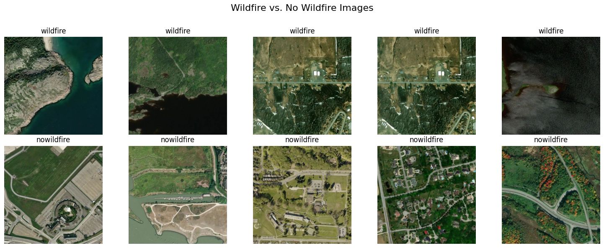

# Wildfire-Prediction-VisionML
ENSTA Pratical Work - Wildfire prediction based on images with vision models

In this project, we aimed to predict whether a satellite image has been affected by wildfire using the [Wildfire Prediction Dataset](https://www.kaggle.com/datasets/abdelghaniaaba/wildfire-prediction-dataset) from Kaggle. To leverage semi-supervised learning techniques, we did not use the labels from the training dataset.

We experimented with various methods to maximize accuracy, exploring different architectures and training strategies. Our approach demonstrates the effectiveness of semi-supervised learning for wildfire detection, which can be valuable in real-world scenarios where labeled data is scarce.




## Quick run

### Installation
To download the dataset and install dependencies, please run :
```
make setup
```

### Run code

If you do not run the code on a slurm cluster, please give an empty value to ```SLURM=""``` at the beginning of the Makefile.

Then, you can chose the method ```METHOD=""``` to run among :
- **Supervised methods** : s_classifier_resnet, s_vit
- **Semi Supervised methods** : ss_selftraining_resnet, ss_clustering_vit_resnet, ss_clustering_segformer_resnet
- **Unsupervised methods** : us_clustering_vit, us_clustering_resnet_net
- **run all the methods one by one** : all

Then, run the following command in the terminal :

```
make run
```

### Debug code

If you want to debug your code, you can change the number of images to use with ```NUM_SAMPLES=``` in the Makefile and run :
```
make debug
```
It reduces the amount of used data and, for certain methods, decreases the number of epochs during training.

If you want to test all your methods in DEBUG mode to check if your modifications do not affect an other part of the codebase, you can run :
```
make test
```

## Codebase Structure

The structure of the codebase allows to easily implement new methods in reusing models used in other methods, and even other methods.

A ```Method``` is a class in the ```methods.py``` file based on this structure :

```python
class Method():

    @abstractmethod
    def process_data(
        train_df: pd.DataFrame,
        valid_df: pd.DataFrame,
        test_df: pd.DataFrame
    ):
        """
        Define the train_dataset, valid_dataset and dataset.
        They can be different from the original ones.
        
        Datasets are utils.WildfireDataset() instances.
        """
        pass

    @abstractmethod
    def run(debug: bool=False):
        """Train and Test the model."""
        pass

    @abstractmethod
    def save(method_name: str, path: str):
        """Save metadata and plot usefull graphs, like loss..."""
        pass
```


In the main file, for any ```Method``` we run these three methods.

If you want to run a new method, you have to add your new method instanciation in the ```get_methods``` function of the ```main.py``` file, as following :


```python
from methods import NewMethod

if method_name == "new_method" or method_name == "all":
        method = NewMethod(...)
        methods_list.append(("new_method", method))
```